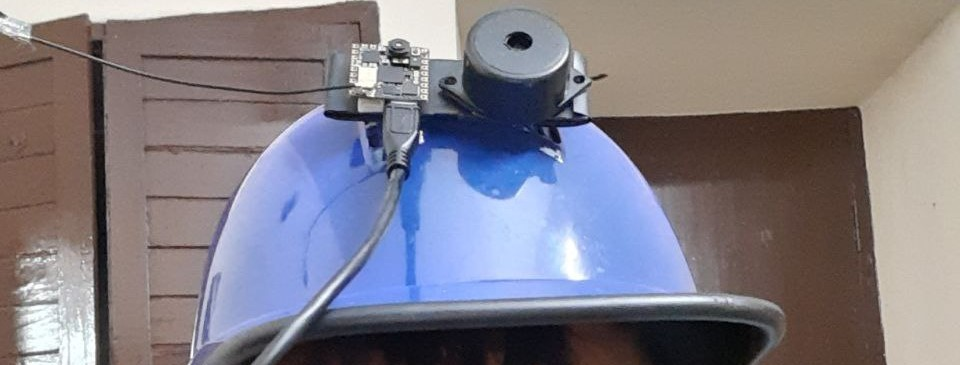
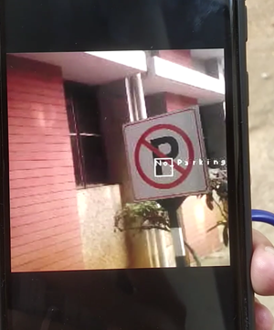
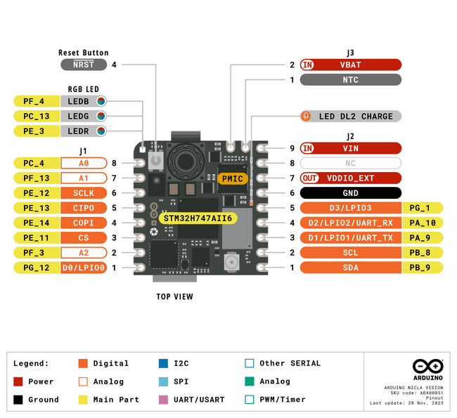
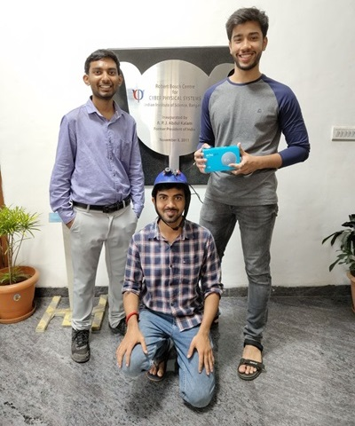

# Sign-Detection using Nicla Vision

	

 

Steps To Run 
1. Change WiFi credentials SSID , KEY to your WiFi name and password in main.py
2. Connect Nicla Vision and copy main.py and trained.tflite , labels.txt  in the Nicla Vision memory. 
3. Buzzer can be connected to  Nicla Vision A0 and GND to detect detection of sign boards.    
4. To view the camera output with classification on web browser open the the following link http://192.168.243.41:8080/ where 192.168.243.41 is your Nicla Vision Ip address which can be obtained by any standard ip scanner. Alternatively, the ip can be viewed by running the code on OpenMv and opening serial monitor where the ip of Nicla Vision is displayed once connected to WiFi.

	

* Models present:
2 tflite models are present in models directory. Model1.tflite consist of 10 classes where place identification boards are present . Model2.tflite consiste of 9 classes where place identification sign board is absent. Place Identification board was added for future scopre of OCR detection in sign boards. By default Model2.tflite is trained.tflite model stored in previous directory. (Change Model2.tflite to trained.tflite when using other model from folder.)

## Additional Info 
1. Device blinks blue light when connected to WiFi.
2. Device blinks yellow light when other device open the ip address link to view camera output.

# Capturing images using Nicla Vision
  
  
1.  Connect a Button to Nicla Vision A0 and GND.
2.  Store the main.py file present in Capture_Picture folder present in Nicla Vision Folder.
3. Change WiFi credentials SSID , KEY to your WiFi name and password in main.py
3. To capture the images using Nicla Vision Camera simply press the button. (Green Led will glow. You may need to press reset button once to view the stored images when connected to the system)
4. Step 3 from Sign-Detection step can be used to view camera output while capturing pictures. 

## Device Testing video
Video Link- https://youtube.com/shorts/v9UbFSp_xE8

## Future Tasks
* Adding OCR to place identification images.
* Adding dog recognition alert feature to prevent accidents.

## Developers

	

 

**Mentor : Prof. Pandarasamy Arjunan**  

**Kunal Wasnik** (L to R in above image) \
**Sanjay Kumar**  \
**Subhasis Panda** 

